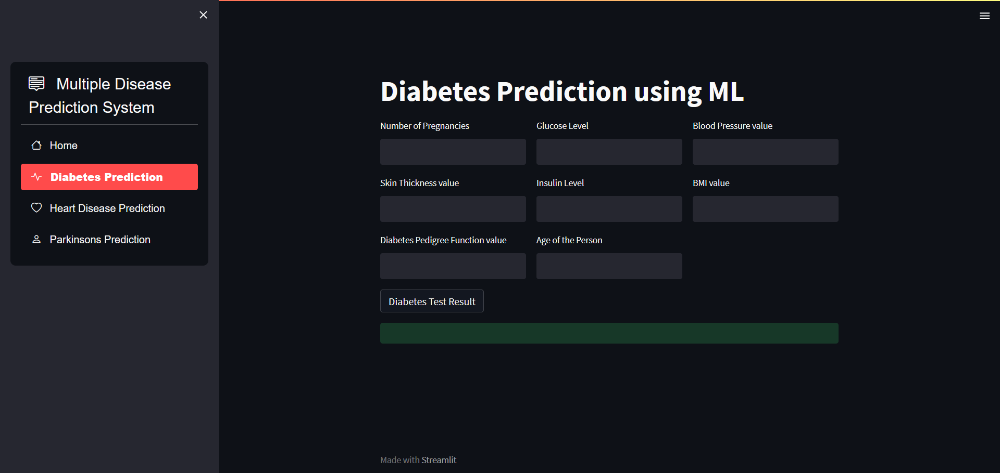
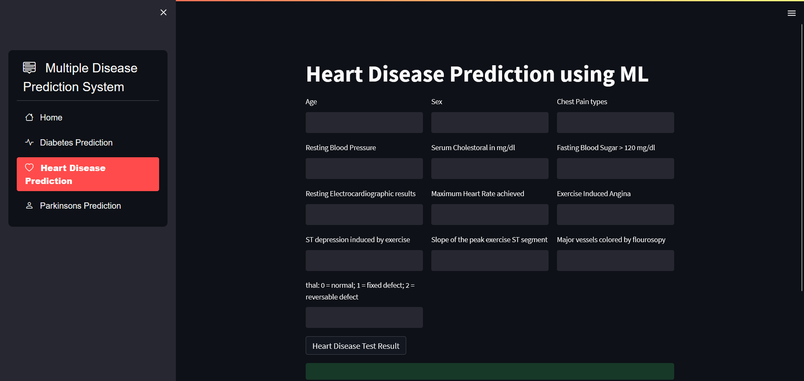
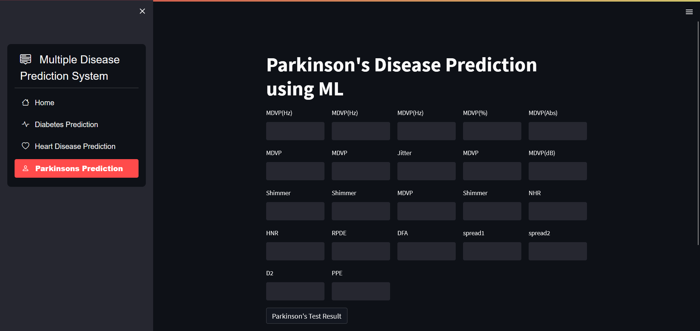

# Multiple Disease Prediction System using Machine Learning

## Overview

This project presents a machine learning-based application designed to predict multiple diseases in real time. It enables early diagnosis and supports medical decision-making by analyzing patient input parameters and producing prediction outcomes instantly. The system is deployed using Streamlit, making it accessible through a web interface without any specialized software requirements.

The system currently predicts the likelihood of:

- Diabetes
- Heart Disease
- Parkinson's Disease

---

## Objective

Develop a machine learning model for real-time disease prediction.

The primary goal is to provide an efficient, accurate, and scalable solution for preliminary disease risk assessment, reducing dependency on manual processes and accelerating clinical decision-making.

---

## Problem Statement

Traditional disease diagnosis involves manual interpretation of patient symptoms and test results. This approach can lead to delays, inconsistencies, and a lack of scalability, particularly when dealing with chronic lifestyle diseases. Early and automated prediction systems can significantly improve screening effectiveness and provide patients with timely alerts.

This project streamlines the diagnosis process by creating a single platform that integrates multiple disease prediction models based on patient health indicators.

---

## Key Features

- Predicts three different diseases using trained machine learning models
- User-friendly interface developed with Streamlit
- Real-time prediction based on user-provided inputs
- Modular and extensible architecture, allowing more diseases to be added
- No requirement for extensive medical systems or external APIs

---

## Application Screenshots

### Diabetes Prediction Page

### Heart Disease Prediction Page

### Parkinson’s Disease Prediction Page

---

## How It Works

1. User enters health parameters into the Streamlit application.
2. The input data is preprocessed and fed to the disease-specific ML model.
3. The trained model evaluates the inputs and generates the prediction.
4. The application displays whether the user is likely to have the disease.

---

## Tech Stack

| Component      | Technology Used |
|---------------|----------------|
| Programming Language | Python |
| Framework | Streamlit |
| Machine Learning | Logistic Regression, Support Vector Machine, Random Forest (and others based on implementation) |
| Libraries | NumPy, Pandas, Scikit-Learn, Streamlit |
| Deployment | Local environment or Streamlit Cloud |

---

## Business Value and Impact

- Reduces dependency on manual diagnosis processes
- Minimizes waiting time for preliminary screening
- Provides support for early detection of chronic diseases
- Enhances data-driven decision-making for healthcare stakeholders
- Can be scaled to incorporate additional disease prediction models

---

## Model Training Workflow
Data Collection → Preprocessing → Feature Selection → Model Training → Model Evaluation → Saving Trained Model → Streamlit Deployment
